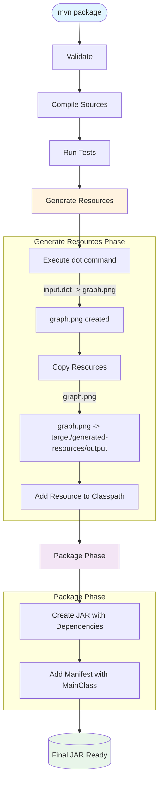

## Code generation

# Maven Build Process Diagram

## Описание процесса сборки

1. **Generate Resources Phase** (фаза генерации ресурсов):
   - `exec-maven-plugin` запускает команду `dot` для конвертации `input.dot` в `graph.png`
   - `maven-resources-plugin` копирует сгенерированный `graph.png` в `target/generated-resources/output`
   - `build-helper-maven-plugin` добавляет этот ресурс в classpath приложения

2. **Package Phase** (фаза упаковки):
   - `maven-assembly-plugin` создает JAR-файл со всеми зависимостями
   - Добавляется манифест с указанием главного класса `ru.akhcheck.Main`

3. **Результат**: 
   - Приложение `Main.java` загружает `graph.png` из ресурсов и отображает его в Swing-окне

